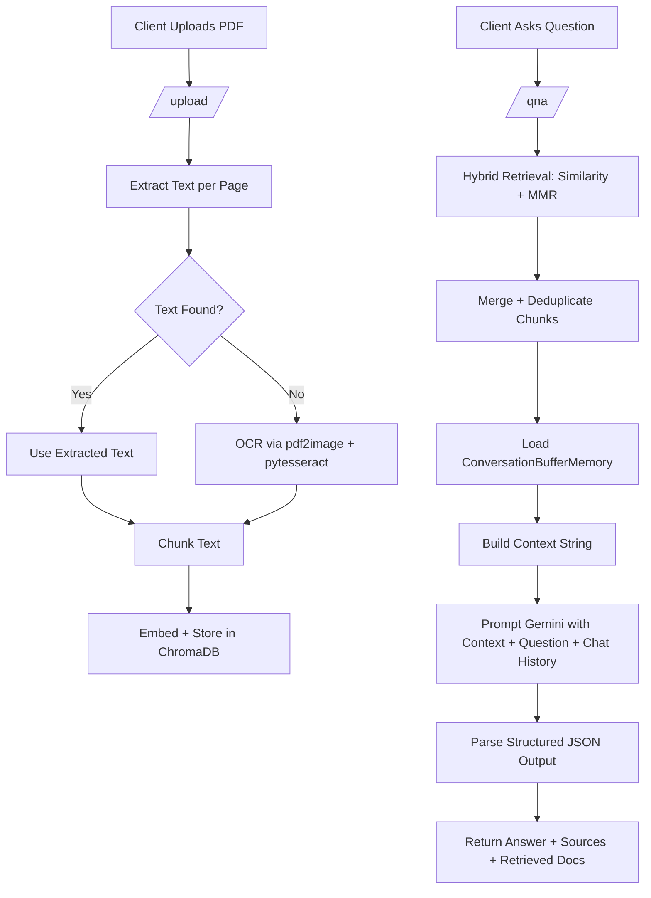

# Document-Dash

A FastAPI-based Retrieval-Augmented Generation (RAG) service that lets you upload PDF documents, index them in ChromaDB, and ask questions grounded in your uploaded content.

The service uses:
- ChromaDB for vector storage
- SentenceTransformer embeddings (`all-MiniLM-L6-V2`)
- LangChain for retrieval orchestration
- ConversationBufferMemory for short-term chat history
- Gemini (`gemini-2.5-flash`) for answer generation
- OCR fallback (Tesseract) for scanned PDF pages

## What This Repo Does

1. Accepts PDF uploads through an API endpoint.
2. Extracts text page by page (with OCR fallback if needed).
3. Chunks text and stores chunks in a persistent Chroma collection.
4. Retrieves the most relevant chunks for a question using hybrid retrieval.
5. Prompts an LLM to answer only from retrieved context.
6. Returns the answer plus sources and retrieved documents.

## Repository Layout

- `main.py`: FastAPI app entrypoint and router registration.
- `upload.py`: PDF ingestion pipeline (extract -> chunk -> index).
- `qna.py`: Question-answer API endpoint.
- `llmservice.py`: RAG chain, retriever, LLM prompt, and response formatting.
- `chromy.py`: Chroma persistent client, collection, and embedding setup.
- `schema.py`: Pydantic request/response models.
- `pyproject.toml`: Project metadata and Python dependencies.
- `chroma_db/`: Persisted Chroma vector store data.

## Architecture Overview



## Detailed RAG Pipeline (Step by Step)

### 1. Document ingestion (`POST /upload/`)

Implemented in `upload.py`.

1. The uploaded file is saved temporarily (`temp_<filename>`).
2. `extract_text_from_pdf(...)` iterates through each PDF page:
	 - First attempts native text extraction with `pdfplumber`.
	 - If page text is missing/empty, converts that page to an image (`pdf2image`) and runs OCR (`pytesseract`).
3. Each page's text is split into overlapping chunks using `RecursiveCharacterTextSplitter`.
4. For each chunk, metadata is attached:
	 - `source` (original filename)
	 - `page_number`
	 - `chunk_index`
	 - `total_chunks`
5. Chunks are added to Chroma collection `documents` with deterministic IDs:
	 - `<filename>_page<page_number>_chunk<chunk_index>`
6. Temporary file is removed.

Result: your document is now searchable by semantic similarity.

### 2. Embedding and storage

Configured in `chromy.py`.

1. A persistent Chroma client writes data under `./chroma_db`.
2. Collection name is `documents`.
3. Embeddings are generated using sentence-transformers model `all-MiniLM-L6-V2`.
4. LangChain embedding wrapper (`HuggingFaceEmbeddings`) is also initialized for retriever usage.

### 3. Retrieval + generation (`POST /qna/`)

Endpoint in `qna.py`, core logic in `llmservice.py`.

1. Request validation:
	 - `question` must be non-empty.
	 - `top_k` must be > 0.
2. `retrieve_and_generate(question, top_k)` runs hybrid retrieval:
	 - Similarity retriever (relevance)
	 - MMR retriever (diversity)
3. Results are merged, deduplicated, and limited to `top_k` chunks.
4. Conversation history is loaded from `ConversationBufferMemory`.
5. Retrieved chunks are formatted into a single `context` string (including metadata).
5. Prompt template instructs LLM to:
	 - Use only retrieved context
	 - Return a structured JSON matching `AnswerResponse`
	 - Say it could not find the answer if context is insufficient
6. `gemini-2.5-flash` generates the response.
7. `PydanticOutputParser` validates/parses structured output.
8. The final answer is written back into conversation memory.
9. API returns:
	 - `answer`
	 - `sources`
	 - `retrieved_documents` (text + metadata)
	 - original `question` and `top_k`

### 4. Failure behavior

- If no documents are retrieved, the service returns a graceful failure payload internally and `qna.py` maps this to an HTTP 500 response.
- Any exception in the RAG chain is logged and converted into a fallback error payload.

## API Endpoints

### Health/root

- `GET /`

Example response:

```json
{
	"RAG APPLICATION": "LETSSS ZOOOGOOO"
}
```

### Upload a PDF

- `POST /upload/`
- Content type: `multipart/form-data`
- Field: `file`

Example:

```bash
curl -X POST "http://localhost:8000/upload/" \
	-H "accept: application/json" \
	-H "Content-Type: multipart/form-data" \
	-F "file=@/absolute/path/to/document.pdf"
```

Example response:

```json
{
	"filename": "document.pdf",
	"chunks_added": 42,
	"pages_processed": 12
}
```

### Ask a question

- `POST /qna/`
- Body: JSON (`question`, optional `top_k`)

Example:

```bash
curl -X POST "http://localhost:8000/qna/" \
	-H "accept: application/json" \
	-H "Content-Type: application/json" \
	-d '{
		"question": "What are the key obligations in section 4?",
		"top_k": 3
	}'
```

Example response shape:

```json
{
	"question": "What are the key obligations in section 4?",
	"answer": "...",
	"sources": ["..."],
	"retrieved_documents": [
		{
			"text": "...",
			"metadata": {
				"source": "document.pdf",
				"page_number": 4,
				"chunk_index": 0,
				"total_chunks": 5
			}
		}
	],
	"top_k": 3
}
```

## Setup

## 1) Prerequisites

- Python 3.11+
- Tesseract OCR installed on your system
- Poppler installed (required by `pdf2image`)
- A Google Gemini API key

On Debian/Ubuntu:

```bash
sudo apt-get update
sudo apt-get install -y tesseract-ocr poppler-utils
```

## 2) Install dependencies

If you use `uv`:

```bash
uv sync
```

Or with pip:

```bash
python -m venv .venv
source .venv/bin/activate
pip install -e .
```

## 3) Configure environment

Create a `.env` file in the repo root:

```env
GEMINI_API_KEY=your_api_key_here
```

## 4) Run the server

```bash
uv run python main.py
```

Server starts on `http://localhost:8000`.

Interactive docs available at:
- `http://localhost:8000/docs`
- `http://localhost:8000/redoc`

## Notes and Current Limitations

- Upload endpoint currently assumes PDF input (no explicit file type validation).
- `top_k` is applied by mutating retriever search kwargs; under heavy concurrent load you may want per-request retriever instances.
- On retrieval miss, endpoint returns HTTP 500 even though this can be considered a no-result case.
- Chroma data is persisted locally in `chroma_db/`.

## Quick Local Test Flow

1. Start server.
2. Upload one PDF via `/upload/`.
3. Ask a question via `/qna/`.
4. Inspect `retrieved_documents` and `sources` to verify grounding.

